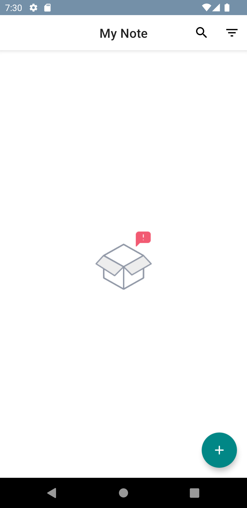
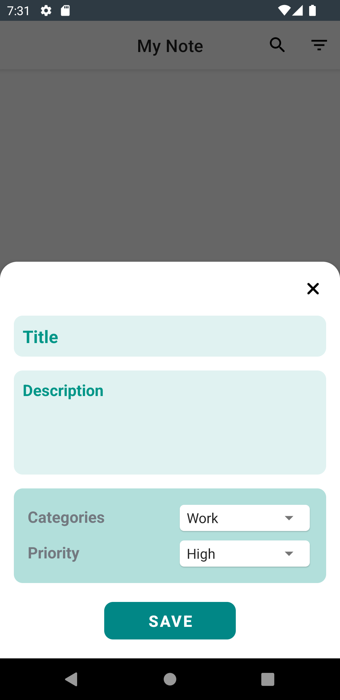
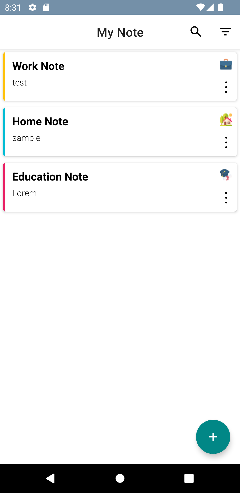
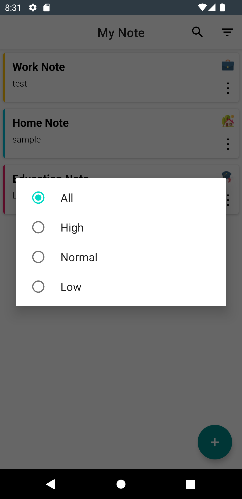
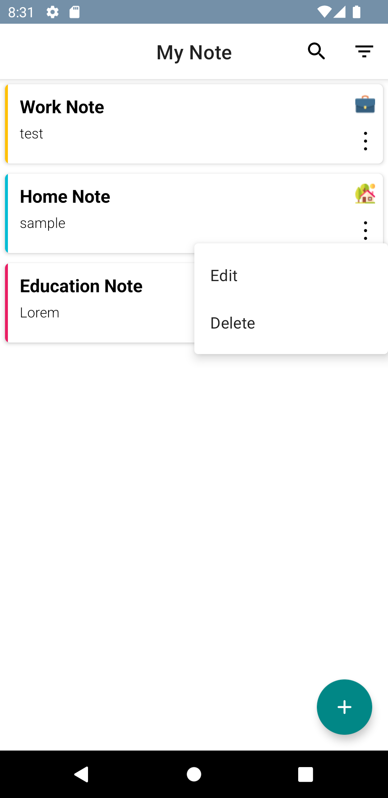

# Simple-Note-App-MVP

Overview :
 
The purpose of this project series is to teach different architectures with different structures, and you can check these architectures and structures.

This project in
- MVP architecture : Current Repo [ Room Database - View Binding - Dagger Hilt - RxJava - Lottie]
- MVVM architecture : https://github.com/ezatpanah/SimpleNoteApp-MVVM [ Room Database - LiveData - Flow - Coroutines - Dagger Hilt - ViewModel - Lottie - View Binding ]
- MVI architecture : Coming soon

The app was written in Kotlin.

 
Technologies and Libraries Used :

- Room Database
- View Binding
- Dagger Hilt
- RxJava
- Lottie

Screen-Shot :
 
    
