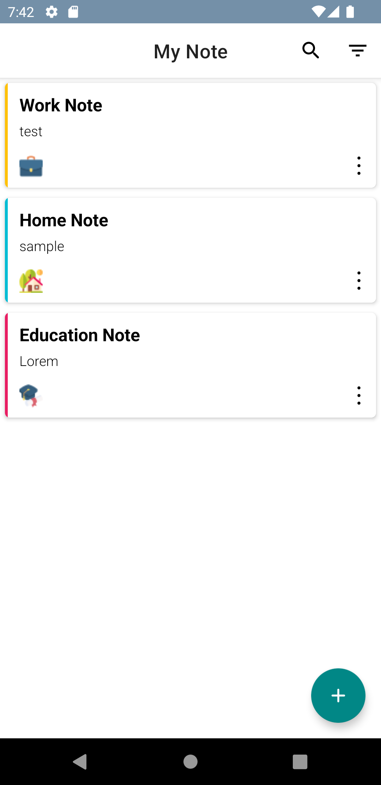
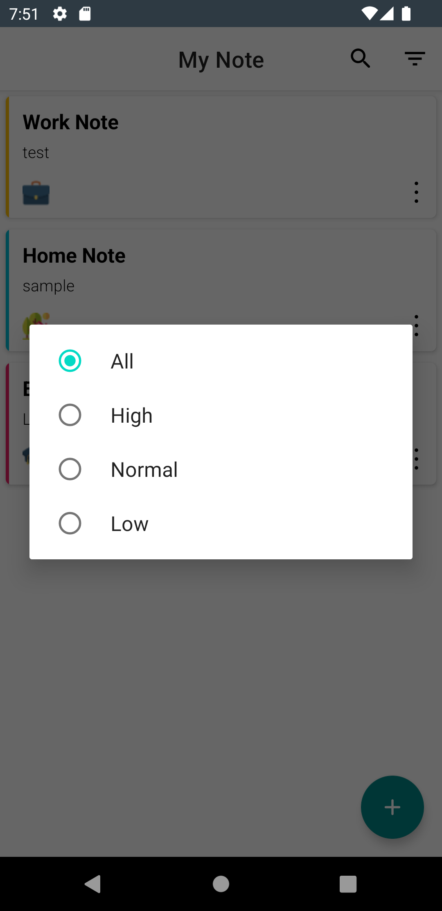
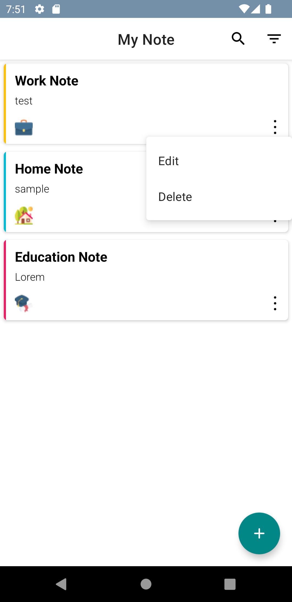

# Simple-Note-App-MVP

Overview :

The purpose of this application is to provide a list of Movies and show the details of each Movie

The app was written in Kotlin.

 
Technologies and Libraries Used :

- Room Database
- View Binding
- Dagger Hilt
- RxJava
- Lottie
- Coil

Screen-Shot :
 

